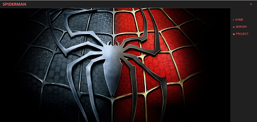
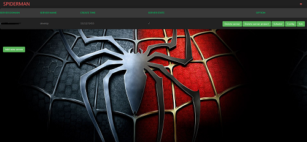
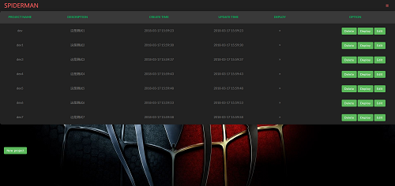

# SpiderMan 
<a href="EN_README.md">English</a> | <a href="README.md">中文</a><br>
## 目录  
* [声明](#声明)  
* [背景介绍](#背景介绍)  
* [项目介绍](#项目介绍)  
* [使用说明](#使用说明)  
  * [获取代码](#获取代码)  
  * [使用实例](#使用实例)  
       * [界面](#界面介绍)  
       * [界面样式](#界面样式)
       * [部署](#部署)  
* [其他](#其他)  
  
<a name="声明"></a>  
## 声明   
*SpiderMan*Web 页面使用了大量 <a href="http://image.baidu.com/">百度图片</a>的无标注版权图片, 如有涉嫌侵权请联系我!
<a name="背景介绍"></a>  
## 背景介绍  
  
*SpiderMan* 基于Scrapy、scrapyd、Scrapyd_API、tornado 爬虫分布式管理框架。<br/>  
*SpiderMan*功能包括爬虫调度，Web端的代码编辑器和新建Scrapy项目等。
  
<a name="项目介绍"></a>  
## 项目介绍  
*SpiderMan* 的设计初衷是给大家提供一个便捷的分布式爬虫管理框架<br>  
*SpiderMan* 是基于scrapyd api 来开发, 不会对现有爬虫代码做任何的侵入<br>
*SpiderMan* 嵌入了web编辑器这样一来就可以在web页面中编写代码,发布代码,部署新的爬虫项目至指定服务器 <br>
*SpiderMan* 目前仅仅利用tornado.ioloop.PeriodicCallback 来完成定时任务, 对各个服务器上单个爬虫进行定时调度<br>
  
<a name="使用说明"></a>  
## 使用说明  
  
<a name="获取代码"></a>  
### 获取代码  
  
* github 项目主页: <https://github.com/PerrorOne/SpiderMan>  
  
  
<a name="使用实例"></a>  
## 使用实例
#### 界面  
* 首页 由于首页我实在是不知道到底应该放一些什么东西, 但是如果没有首页的话,总是感觉觉怪怪的!<br>   
* 服务器 主要是用于对scrapyd 服务器的管理包括了: 添加新的服务器、调度服务器指定的蜘蛛、删除指定服务器的项目
* 项目 新建本地项目部署至指定服务器, 该页面包含了: 添加新的项目, 删除项目, 编辑项目代码, 部署项目

#### 界面样式
* 首页 <br> 
* 服务器 <br> 
* 项目<br>
* 还有一些子页面.....

#### 部署
```
克隆项目至本地
git clone https://github.com/PerrorOne/SpiderMan.git
cd SpiderMan
python setup.py install
# 初始化项目
SpiderMan init
# 创建管理员账号
SpiderMan admin
#=================使用docker部署======================
git clone https://github.com/PerrorOne/SpiderMan.git
cd SpiderMan
docker build -t spiderman:v1 .
# 进入系统创建admin用户
docker run -it -p 8080:8080 spiderman:v1 /bin/bash
# sh
/root/anaconda3/envs/spderman/bin/SpiderMan init
# 启动
docker run -d -p 8080:8659 spiderman:v1
# 支持从环境变量中读取配置
--env MYSQL_PORT=3306
--env MYSQL_HOST=127.0.0.1
--env MYSQL_USER=root
--env MYSQL_PASS=99999
--env ADMIN_USER=perror // 创建管理员
--env ADMIN_PASS=123456 // 管理员密码
--env CMD=1 // 由于某些原因这个参数是必需的
# 示例：
docker run -d -p 8080:8659 --env MYSQL_PORT=3306 --env MYSQL_HOST=127.0.0.1 \
--env MYSQL_USER=root --env MYSQL_PASS=99999 --env ADMIN_USER=perror \
--env ADMIN_PASS=123456 --env CMD=1 spiderman:v1
# 浏览器中输入：127.0.0.1:8080
```

#### 其他

由于本人编程水平有限并且只有我一个人在开发,<br>
页面没有实现国际化, 定时任务程序过于简单,等等...<br>
如果各位朋友有更好的想法、更好的实现或是发现bug.欢迎fork修改!<br>
最后祝各位生活愉快!<br> 
